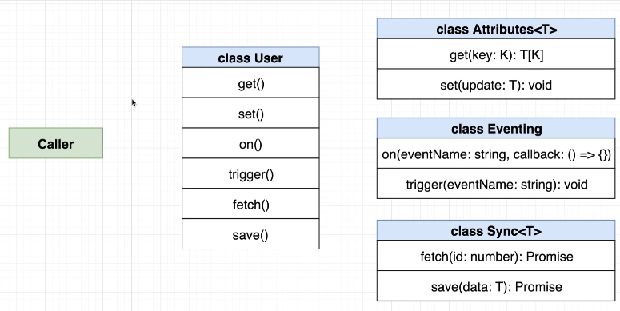
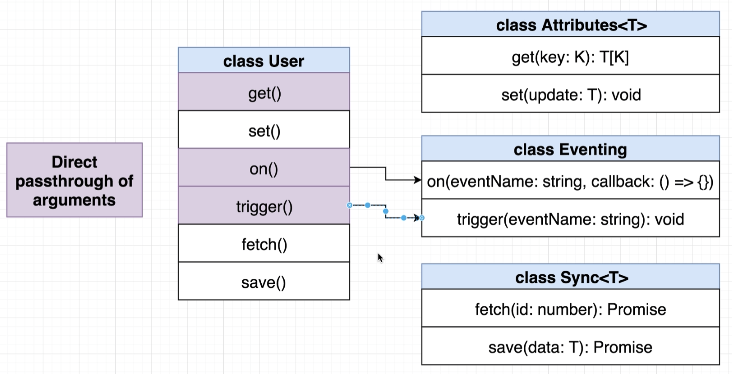
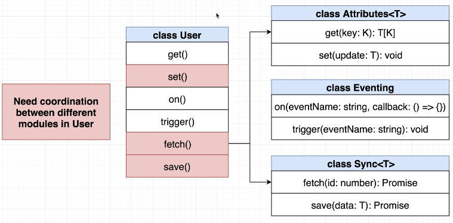

# Web Framework Notes

Setup parcel:
```
npm i -g parcel-bundler
parcel index.html
```
start json-server
```
json-server --watch db.json
```
> Need both json-server and parcel running at the same time. 
## Framework Structure

Inside our framework we will have two types of **classes.**
1. Model Classes:
   - Handle data, used to represent Users, Blog Posts, Images, etc.
2. View Classes:
  - Handle HTML and events cause by user (such as clicks).
---
class User
- Will need to create a class to represent a **User** and all of its data (like name and age).
  - User class needs to have the ability to store some data, retrieve data, and change it. 
  - needs ability to notify the rest of the app when data is changed. 
  - User needs to be able to persist data to an outside server, and also retrieve the data at some point.
---
**Extraction Approach**
- **Build** class User as a 'mega' **class** with lots of methods. 
- Refactor User to use **composition**.
- Refactor User to be a **reusable class** that can represent **any piece of data**, not just a User. 
---
**class User**
- private **data**: UserProps
  - object to store information about a particular user.
  - private = cannot access this property outside this class.
  - want to allow other devs to use other methods (get() and set()) to change the data.
- get(propName: string): (string | number)
  - **retrieve** a single piece of info about this user (name, age). `get('name')`
- set(update: UserProps): void
  - **changes** information about this user (name, age).
- on(eventName: string, callback: () => {})
  - **registers** an event handler with this object, so other parts of the app know when something changes.
- trigger(eventName: string): void
  - **triggers** an event to tell other parts of the app that something has changed.
- fetch(): Promise
  - **fetches** some data from the server about a particular user.
- save(): Promise
  - **saves** some data about this user to the server.

# Composition class User

```typescript
interface UserProps {
  name: string;
  age: number;
}

export class User {
  constructor(private data: UserProps) {}
  
  get(propName: string): (number | string) {
    return this.data[propName];
  }
}

// index.ts
import { User } from "./models/User";

const user = new User( {name: 'myname', age: 20 });

console.log(user.get('name'));
console.log(user.get('age'));
```

###  User set() method
```typescript
  set(update: UserProps): void {
    Object.assign(this.data, update);
  }
```
> Object.assign() takes the data from `update` and overwrites the data in `this.data`.

```typescript
// index.ts
import { User } from "./models/User";

const user = new User( {name: 'myname', age: 20 });

console.log(user.get('name')); // myname
console.log(user.get('age')); // 20

user.set({ name: 'newname', age: 9999 });

console.log(user.get('name')); // newname
console.log(user.get('age')); // 9999
```

> Issue: can not update only ONE property. 
> If we try to only update `name` we get an error.

Can solve issue by changing properties in `interface UserProps` to **optional.** Do this by adding `?` beside the optional property names.
```typescript
interface UserProps {
  name?: string;
  age?: number;
}

// index.ts
import { User } from "./models/User";

const user = new User( {name: 'myname', age: 20 });

console.log(user.get('name'));
console.log(user.get('age'));

user.set({ name: 'newname'}); // this will now work

console.log(user.get('name'));
console.log(user.get('age'));
```

### class User on() and trigger() method
`on(eventName: string, callback: () => {})`
Used to **register** an event handler with this object, so other parts of the app know when something changes.

`trigger` runs all the callback functions that have been registered by `on()`.

---
- indicate that `callback` is going to be a function by stating `() => void`.
- could also create a **type alias** for `() => void`.
```typescript
type Callback = () => void
class User {
  on(eventName: string, callback: Callback) {
// ...
  }
}
```
`eventName` could be 'click', 'hover', 'mouseover'. Need to be able to receive events and store them.

Will use an object to store all the types of callbacks.
**Keys** of the object will be **event names**. The **values** will be **arrays of all the Callbacks**.

Will store this property in class User:
```typescript
events: { [key: string]: Callback[] } = {};
```
> `[key: string]` could be any event. "click" "hoverover". This will store our event names. 
> ` Callback[]` states that the values will be an array of callback functions. 

```typescript
  on(eventName: string, callback: Callback): void {
    const handlers = this.data[eventName] || [];
    handlers.push(callback);
    this.events[eventName] = handlers;
  }
```
```typescript
// index.ts

import { User } from "./models/User";

const user = new User( {name: 'myname', age: 20 });

user.on('change-any-event', () => {

});

console.log(user);
// User {data: {…}, events: {…}}
// data: {name: 'myname', age: 20}
// events: {change-any-event: Array(1)}
// [[Prototype]]: Object
```
> we can confirm the `on()` method is working.

## Trigger event callbacks

```typescript
// Users.ts
trigger(eventName: string): void {
    const handlers = this.events[eventName]; 
    
    //can be undefined when User is first created
    if(!handlers || handlers.length === 0) {
      return;
    }

    handlers.forEach((callback: Callback) => {
      callback();
    })
  }

  //index.ts
  import { User } from "./models/User";

const user = new User( {name: 'myname', age: 20 });

user.on('change', () => {
  console.log('change number one');
});
user.on('change', () => {
  console.log('change number two');
});
user.on('save', () => {
  console.log('save was triggered');
});


user.trigger('change')
// change number one
//change number two
user.trigger('save')
// save was triggered
```

# Adding JSON Server

- uses [JSON server from npm.](https://www.npmjs.com/package/json-server)
  - can receive information and store it in a json file.

```
npm install -g json-server
```
Whenever we run  `json-server` we need to point it to a actual json file which will save our data. 

Create a `db.json` file with some data.
```json
{
  "users": []
}
```
> Tells json-server that we are going to serve up a resource called 'users'. json-server will then create routes for us. 

Start JSON Server
```
json-server --watch db.json
```
json-server routes your 'user' to http://localhost:3000/users 

---

Want to use **axios** to communicate with our User model and the server.

Install Axios:
```
npm install axios
```

then start parcel:
```
parcel index.html
```

# REST Conventions
| Methods	|       Path     |      Result    |
| ------- | ------------- | -------------- |
|  GET   	|  /posts       | retrieve all posts |
|  GET  	|  /posts/:id   | retrieve posts with the given ID |
|  POST   |  /posts       |  create a new post |
|  PUT    |  /posts/:id   |  update a post |
|  DELETE |  /posts:id    | deletes a post |

```typescript
//index.ts
import axios from 'axios';

axios.post('http://localhost:3000/users', {
  name: 'myName',
  age: 20
})


// in Dev tools Network XHR
{name: "myName", age: 20, id: 19}
age: 20
id: 19
name: "myName"
```

All our models that need to be synced with a server need an 'ID' property. 
If a User does NOT have an ID, then this means it is NOT on the server. 

## Fetch Method
```typescript
  fetch(): void {
    axios
      .get(`http://localhost:3000/users/${this.get('id')}`)
      .then((response: AxiosResponse): void => {
        this.set(response.data)
      })
  }

 // index.ts
 import { User } from './models/User';

const user = new User({ id: 3 });

user.fetch();
```

## Save()

Have to check to see if our user has an ID.
If they have an ID, need to use **PUT** method because we are **updating** information on the server. 
If no ID is found, then we need to use **POST** method, because we are creating a new user. 

```typescript
save(): void {
    const id = this.get('id');

    if(id) {
      // put
      axios.put(`http://localhost:3000/users/${id}`, this.data)
    } else {
      // post
      axios.post('http://localhost:3000/users', this.data)
    }
  }

// index.ts
import { User } from './models/User';

const user = new User({ id: 1 });

user.set({ name: 'NEW NAME', age: 9999 });

user.save();
```
> after saving and running parcel and json-server, then you should see db.json update the new information. This is using the put method. 

# Refactoring with Composition
Will be refactoring the class **User** to extract the various methods inside it. We currently have a ton of functions (get, on, trigger, fetch and save).

Goal: Have individual classes responsible for:
- storing user data.
- eventing logic.
- persistance of data (save).
---
```typescript
// Eventing.ts
// implement class responsible for events tied to a User

type Callback = () => void;

export class Eventing {
  events: { [key: string]: Callback[] } = {};

  on(eventName: string, callback: Callback): void {
    const handlers = this.events[eventName] || []; //can be undefined when User is first created
    handlers.push(callback);
    this.events[eventName] = handlers;
  }

  trigger(eventName: string): void {
    const handlers = this.events[eventName]; 
    
    //can be undefined when User is first created
    if(!handlers || handlers.length === 0) {
      return;
    }

    handlers.forEach((callback: Callback) => {
      callback();
    })
  }
}
```
### Re-integrating attributes, events and sync
In the end, we want clasS **User** to have properties:
- **attributes: Attribute**
  - gives us the ability to **store** properties of the User (name, age, etc.).
- **events: Events**
  - gives us the ability to **tell other parts of our app** whenever data tied to a particular User is changed.
- **sync: Sync**
  - gives us the ability to **save** this persons data to a **remote server**, then retrieve it in the future. 

---
**Option 1:**
We will only accept dependencies into the constructor of `User` class.
This will define a **static class method** to pre-configure `User` and **assign properties afterwards.**

```typescript
export class User {
  static fromData(data: UserProps): User {
    const user = new User(new Eventing());
    user.set(data);
    return user;
  }

  private data: UserProps;
  
  constructor(private data: Eventing) {}
  //...
}
```

However, we run into some issues.
- Have to initialize `user` every time. What is we had a class that requires lots of things to be initialized when we create it.
  - `user.set(data);` is only one line of code here, but could become very long in the future. 

---

**Option 2:**
- constructor accepts **properties**.
- **hard code** dependencies as a **class property.**
> will be going forward with this option.

```typescript
export class User {
  public events: Eventing = new Eventing();

  constructor(private data: UserProps) {}
  //...
}

// index.ts
import { User } from './models/User';

const user = new User({ name: 'new record', age: 0});

user.events.on('change', () => {
  console.log('Change was made!');
});

user.events.trigger('change');
```

### adding sync: Sync property to class User
- remember, allows us to save and fetch information from our backend server.
- want to extract both the fetch() and save() method from class User, and make then their own class.

```typescript
// new Sync.ts file
import axios, { AxiosResponse } from 'axios';

export class Sync {
  fetch(): void {
    axios
      .get(`http://localhost:3000/users/${this.get('id')}`)
      .then((response: AxiosResponse): void => {
        this.set(response.data)
      })
  }

  save(): void {
    const id = this.get('id');

    if(id) {
      // put
      axios.put(`http://localhost:3000/users/${id}`, this.data)
    } else {
      // post
      axios.post('http://localhost:3000/users', this.data)
    }
  }
}
```
**Issue:** we have a bunch of errors (set, get, data) because these refer to our class User. 
  

**Possible Solutions**

Option 1:
**Serialize**: convert data from an object into some save-able format (json).
**Deserialize**: put data on an object using some previously saved data (json). Json -> parse -> object.

Possible solution: Sync expects arguments that satisfy the interfaces 'Serialize' and 'Deserialize'. 

Option 2: Sync is turned into a **generic class** to customize the type of 'data' coming to save().
- class User will contain `sync: Sync<UserProps>`
- and class Sync<T> will be generic. 

## Refactoring class Sync into a generic
```typescript
import axios, { AxiosPromise } from 'axios';
import { UserProps } from './User';

export class Sync {

  constructor(public rootUrl: string) {}

  fetch(id: number): AxiosPromise {
    return axios.get(`${this.rootUrl}/${id}`)

  }

  save(data: UserProps): AxiosPromise {
    const id = data.id;

    if(id) {
      // put
      return axios.put(`${this.rootUrl}/${id}`, data)
    } else {
      // post
      return axios.post(this.rootUrl, data)
    }
  }
}
```
> So we have written this assuming are always using UserProps. Not generic yet. 

Need to define an interface for the `id` property. We currently have an error on `id` because Typescript does not know what type of data it will be receiving. 
```typescript
import axios, { AxiosPromise } from 'axios';

export class Sync<T> {

  constructor(public rootUrl: string) {}

  fetch(id: number): AxiosPromise {
    return axios.get(`${this.rootUrl}/${id}`)
  }

  save(data: T): AxiosPromise {
    const id = data.id;

    if(id) {
      return axios.put(`${this.rootUrl}/${id}`, data)
    } else {
      return axios.post(this.rootUrl, data)
    }
  }
}
```

```typescript
import axios, { AxiosPromise } from 'axios';

interface HasId {
  id: number;
}

export class Sync<T extends HasId>{

  constructor(public rootUrl: string) {}

  fetch(id: number): AxiosPromise {
    return axios.get(`${this.rootUrl}/${id}`)
  }

  save(data: T): AxiosPromise {
    const id = data.id;

    if(id) {
      return axios.put(`${this.rootUrl}/${id}`, data)
    } else {
      return axios.post(this.rootUrl, data)
    }
  }
}
```
So now when we use Sync, we must take in a type which is defined by `HasId`, which must be a number. 

Now need to wire up Sync back into User.
```typescript

import { Eventing } from './Eventing';
import { Sync } from './Sync';


export interface UserProps {
  id?: number;
  name?: string;
  age?: number;
}

const rootUrl = 'http://localhost:3000/users'

export class User {
  public events: Eventing = new Eventing();
  public sync: Sync<UserProps> = new Sync<UserProps>(rootUrl);

  constructor(private data: UserProps) {}
  // access properties on our User
  get(propName: string): (number | string) {
    return this.data[propName];
  }

  set(update: UserProps): void {
    Object.assign(this.data, update);
  }
}

```

Have a new error: "Type 'UserProps' does not satisfy the constraint 'HasId'." under `UserProps`. 
In Sync.ts, the `id` property in the interface HasId has property 'id', however it is not optional like it is in User.ts. Simple solution: make it optional. 
```typescript
//Sync.ts
interface HasId {
  id?: number;
}
```

### creating attributes on class User

- The constructor, get() and set() on class User are all attributes on user. 
- We will be extracting these and creating a new Attributes model for them. 
- Need to change Attributes into a generic class, just like we did with Sync.
```typescript
export class Attributes <T> {
  constructor(private data: T) {}
  // access properties on our User
  get(propName: string): (number | string) {
    return this.data[propName];
  }
  set(update: T): void {
    Object.assign(this.data, update);
  }
}
```
> However, `get(propName: string): (number | string)` states we will always return a number or a string. It states we will ONLY store a number or a string. However this may not always be true. Lets change this. 

# Important Rules in Typescript
1. in TypeScript, **strings** can be types. 
   `type Bestname = 'curtis';` 
   `const printName = (name: BestName): void => {}`
   - here in the function we are essentially saying you must call `printName` with ONLY 'curtis'. Only this will work: `printName('curtis')`.
2. in JavaScript (and therefore TypeScript), all **object keys are string**.
```javascript
const colors = {};
colors.red = 'red';
 // 'red'
colors[5] = 'red';
console.log(colors) // {5: 'red', red: 'red'}
// here it looks like 5 is a number.
// however, it is a string

console.log(colors['5']) // 'red'
// we used a string for the key and it still worked.
```
In the background, when we declared `colors[5] = 'red'`, the [5] was first converted to a string, then set as a key. 

Impact of these two rules together: **On an object, the keys of an object can actually be a type as well.**

---

```typescript
export class Attributes <T> {
  constructor(private data: T) {}
  // access properties on our User
  get<K extends keyof T>(key: K): T[K] {
    return this.data[key];
  }

  set(update: T): void {
    Object.assign(this.data, update);
  }
}
```
The letter K is not some special operator. It could be named anything (KeyOfObject).

`<K extends keyof T>` sets up a **generic constraint** which limits the types that K can be. It limits K to one of the keys of T can be (number, string). We are imagining that T is only going to be UserProps for now.
Remember:
```typescript
export interface UserProps {
  id?: number;
  name?: string;
  age?: number;
}
```
Type annotation `(key: K)` states we can only call `get()` with either 'name', 'age' or 'id'. 

As a return value, ` T[K]` is basically a normal object lookup. Is the same as:
```
const colors = {red: 'red''};
colors['red']
```
It looks at the UserProps interface, the key value (id, name or age), and returns the corresponding value (number, string or number).

We are saying look at the interface of T, and return the value at the key of K.
TypeScript will loop up the name, age or id, and return the corresponding type (string, number or number)

---

All together to test this out
```typescript
import { UserProps } from './User';

export class Attributes <T> {
  constructor(private data: T) {}
  // access properties on our User

  get<K extends keyof T>(key: K): T[K] {
    return this.data[key];
  }

  set(update: T): void {
    Object.assign(this.data, update);
  }
}

const attrs = new Attributes<UserProps>({
  id: 5,
  age: 20,
  name: 'Whatever'
});

const id = attrs.get('id'); // hover over id: returns number
const name = attrs.get('name'); // hover over name: returns string
const age = attrs.get('age'); // hover over age: returns number
```
> We get this behavior because of this extra syntax `<K extends keyof T>(key: K): T[K] `

--- 
Back in the Users.ts
```typescript

import { Attributes } from './Attributes';
import { Eventing } from './Eventing';
import { Sync } from './Sync';


export interface UserProps {
  id?: number;
  name?: string;
  age?: number;
}

const rootUrl = 'http://localhost:3000/users'

export class User {
  public events: Eventing = new Eventing();
  public sync: Sync<UserProps> = new Sync<UserProps>(rootUrl);
  public attributes: Attributes<UserProps> = new Attributes<UserProps>(<ERROR>)

}

```

Get an error when creating a new Attributes because it has to accept some argument. However, this isn't great because we just want to be able to call `new User({name: 'sfsd', age: 13 })`, but if we hard code `new Attributes` with some arguments, this wont be possible. 

Can fix this by creating a constructor which takes in the properties for the attributes.
```typescript
export class User {
  public events: Eventing = new Eventing();
  public sync: Sync<UserProps> = new Sync<UserProps>(rootUrl);
  public attributes: Attributes<UserProps>;

  constructor(attrs: UserProps) {
    this.attributes = new Attributes<UserProps>(attrs)
  }
}
```



We don't want to allow caller to reach directly into the methods in class Attributes, Eventing, and Sync. 
Instead, we want Caller to use the class User, and use the methods defined in there. For example, Caller uses save(), which delegates the appropriate class. 



More complicated coordinations:

For class User methods such as `fetch`, we need to access the `get()` method on `class Attributes`, and then call the `fetch()` method on `class Sync`.

---

A quick reminder on **accessors or getters**
```typescript
class Person {
  constructor(public firstName: string, public lastName: string) {}

  fullName(): string {
    return `${this.firstName} ${this.lastName}`;
  }
}

const person = new Person('firstname', 'lastname');
console.log(person.fullName()); // firstname lastname

```

Could write this as a **getter or setter**. 
Done by adding the `get` keyword to the method.
We do **not need to add `()` when we call the method. **
```typescript
class Person {
  constructor(public firstName: string, public lastName: string) {}

  get fullName(): string {
    return `${this.firstName} ${this.lastName}`;
  }
}

const person = new Person('firstname', 'lastname');
console.log(person.fullName); // firstname lastname
```

## Passthrough Methods

On Method in Users.ts
```typescript
  get on() {
    return this.events.on;
  }
```

Since we use a `getter`, we are referencing the `on` method on the class Eventing. 
We can now call `user.on('change', () => console.log('user was changed');)`, referencing the class Eventing. 
`user.on` invokes the **on method on class Eventing.**

Complete the other methods:
```typescript

import { Attributes } from './Attributes';
import { Eventing } from './Eventing';
import { Sync } from './Sync';


export interface UserProps {
  id?: number;
  name?: string;
  age?: number;
}

const rootUrl = 'http://localhost:3000/users'

export class User {
  public events: Eventing = new Eventing();
  public sync: Sync<UserProps> = new Sync<UserProps>(rootUrl);
  public attributes: Attributes<UserProps>;

  constructor(attrs: UserProps) {
    this.attributes = new Attributes<UserProps>(attrs)
  }

  get on() {
    return this.events.on;
  }

  get trigger() {
    return this.events.trigger;
  }

  get get() {
    return this.attributes.get;
  }
}
```
---

However, if we try to run the get method inside index.ts, we get an error:
```typescript
import { User } from './models/User';

const user = new User({ name: 'new record', age: 0});

console.log(user.get('name')); // Uncaught TypeError: Cannot read properties of undefined (reading 'name')
```
Reminder on how 'this' works in javascript
```typescript
const colors = {
  color: 'red',
  printColor() {
    console.log(this.color);
  }
}

colors.printColor(); // red

const printColor = colors.printColor;

printColor(); // undefined. Because there is nothing to the left.
```
Rule of thumb, `this` will call on whatever is to the left of it. In this case (`colors.printColor()`), colors is to the left. 

Can solve this issue by adding an **arrow function** to our `get` method in class Attributes.
```typescript
export class Attributes <T> {
  constructor(private data: T) {}
  // access properties on our User

  get = <K extends keyof T>(key: K): T[K] => {
    return this.data[key];
  }

  set(update: T): void {
    Object.assign(this.data, update);
  }
}
```
> now `this` no matter what will ALWAYS be equal to our instance of class Attributes.

Need to do the same thing for our Eventing.ts class.
```typescript
type Callback = () => void;

export class Eventing {
  events: { [key: string]: Callback[] } = {};

  on = (eventName: string, callback: Callback): void => {
    const handlers = this.events[eventName] || []; //can be undefined when User is first created
    handlers.push(callback);
    this.events[eventName] = handlers;
  }

  trigger = (eventName: string): void => {
    const handlers = this.events[eventName]; 
    
    //can be undefined when User is first created
    if(!handlers || handlers.length === 0) {
      return;
    }

    handlers.forEach((callback: Callback) => {
      callback();
    })
  }
}
```

Can now test this in index.ts
```typescript
import { User } from './models/User';

const user = new User({ name: 'new record', age: 0});

console.log(user.get('name'));

user.on('change', () => {
  console.log('User was changed');
});

user.trigger('change');
```

## setup more complicated methods on class User

**set()** and **fetch()**

```typescript
set(update: UserProps): void {
    this.attributes.set(update);
    this.events.trigger('change')
  }

fetch(): void {
 const id = this.get('id');

 if (typeof id !== 'number') {
   throw new Error('Cannot fetch without an id');
 }

 this.sync.fetch(id).then(
   (response: AxiosResponse): void => {
     this.set(response.data);
   }
 );
}
```
### save()
```typescript
  save(): void {
    this.sync.save(this.attributes.getAll())
      .then((response: AxiosResponse): void => {
        this.trigger('save');
      })
      .catch(() => {
        this.trigger('error');
      })
  }

//index.ts
import { User } from './models/User';

const user = new User({ id: 1, name: 'newer name', age: 0 });

user.on('save', () => {
  console.log(user);
});

user.save();
```
## Issues with our code at the moment:
1. Using many **public** methods. We want others to use the get(), set(), on()... methods instead. NOT the events, sync and attributes.
2. **Hardcoded** our sync method. We are currently ONLY accessing data from our json-server. What if we wanted to access data locally instead?
3. Not using **interfaces**. 
4. Right now we have a ton of functionality inside class User. What if we want a second class called BlogPost? We don't want to re-implement every method from User. Need to make it more **re-usable.**

Possible Solutions:
- Have a very simple class User.
  - this would reference an **instance** of **class Model**, which would contain **all the methods (get, set, on, trigger, fetch, save).**
  - would also allow you to add custom methods for class User (fullName(), isAdminUser()).
  - Downside: would have to passthrough Model everytime we access a method from Model.
    - for example, to access User name, it would be `user.model.get()`, but if we wanted to access fullName, it would just be use.fullName().
    - to access different information we have to use completely different syntax.
    - gets confusing because we have all these nested properties. 

To fix this, we can use **inheritance.** This allows us to access all the properties of Model.

# Extracting Methods from User to class Model

```typescript
import { AxiosPromise, AxiosResponse } from "axios";

// need this to be a generic<T>
interface ModelAttributes<T> {
  set(value: T): void;
  getAll(): T;
  get<K extends keyof T>(key: K): T[K];
}

interface Sync<T> {
  fetch(id: number): AxiosPromise;
  save(data: T): AxiosPromise;
}

interface Events {
  on(eventName: string, callback: () => void): void;
  trigger(eventName: string): void;
}

interface HasId {
  id?: number;
}

export class Model<T extends HasId> {
  constructor(
    private attributes: ModelAttributes<T>,
    private events: Events,
    private sync: Sync<T>
  ){}

  get on() {
    return this.events.on;
  }

  get trigger() {
    return this.events.trigger;
  }

  get get() {
    return this.attributes.get;
  }

  set(update: T): void {
    this.attributes.set(update);
    this.events.trigger('change');
  }

  fetch(): void {
    const id = this.get('id');

    if (typeof id !== 'number') {
      throw new Error('Cannot fetch without an id');
    }

    this.sync.fetch(id).then(
      (response: AxiosResponse): void => {
        this.set(response.data);
      }
    );
  }

  save(): void {
    this.sync.save(this.attributes.getAll())
      .then((response: AxiosResponse): void => {
        this.trigger('save');
      })
      .catch(() => {
        this.trigger('error');
      })
  }
}
```

[More in depth](https://www.udemy.com/course/typescript-the-complete-developers-guide/learn/lecture/15067010#overview)

```typescript
//in user.ts

import { Model } from "./Models";

export interface UserProps {
  id?: number;
  name?: string;
  age?: number;
}

const rootUrl = 'http://localhost:3000/users';

export class User extends Model<UserProps> {
  static buildUser(attrs: UserProps): User {
    return new User(
      new Attributes<UserProps>(attrs),
      new Eventing(),
      new ApiSync<UserProps>(rootUrl)
    )
  }
}
```
Now anytime we want to create a new user we will be passing in the starting attributes (attrs), which will create a new **instance of user,** initializing Attributess, Eventing and ApiSync.

# UserCollection class
- will have a **models** property that will be an array of Users (User[]).

```typescript
import { Eventing } from "./Eventing";
import { User } from "./User";

export class Collection {
  models: User[] = [];

  events: Eventing = new Eventing();

  get on() {
    return this.events.on;
  }
  
  get trigger() {
    return this.events.trigger;
  }
}
```
- now need to parse the JSON data.

```typescript
import axios, { AxiosResponse } from "axios";

axios.get('http://localhost:3000/users')
  .then((response: AxiosResponse) => {
    console.log(response.data);
  })

// in console we get back:
/// {id: 1, name: 'newer name', age: 0}
// {name: 'new record', age: 0, id: 2}

```

## Making class Collection Generic\
Currently have:
```typescript
import axios, { AxiosResponse } from "axios";
import { Eventing } from "./Eventing";
import { User, UserProps } from "./User";


export class Collection {
  models: User[] = [];
  events: Eventing = new Eventing();

  constructor(public rootUrl: string) {}

  get on() {
    return this.events.on;
  }
  
  get trigger() {
    return this.events.trigger;
  }

  fetch(): void {
    axios.get(this.rootUrl)
      .then((response: AxiosResponse) => {
        response.data.forEach((value: UserProps) => {
          const user = User.buildUser(value);
          this.models.push(user)
        });

        this.trigger('change');
      });

  }
}

```

K will specify the type of data we get back.

# Adding HTML

- UserShow will display User details (name, age).
- UserForm will allow input, update name, set random age, save data.
- Both UserShow and UserForm will be nested in UserEdit.
- Hierarchy:
  - UserEdit
    - UserShow and UserFrom
---
- Each view **must** produce HTML.
- We should be able to nest one views HTML into another.
- We need to have a good way to **handle user events** (clicking, typing).
- There will probably be **tight coupling** between a view and a model.
- We need to be able to reach into the HTML produced by a view and **get specific information.**

## Class UserForm

- Parent: Element
  - will be a reference to an element in the DOM. 
  - will be used by render()
- template(): string
  - returns a string that contains some amount of HTML we want to show to the user. 
  - may return a text input and 3 buttons.
    - form with a label and input.
- render(): void
  - wants to take the HTML from template, and inserts it into the DOM.
  - will take the form, label and input and append it to the parent **property** (above).
    - this will be some element that already exists in our DOM.

**[Template Element](https://developer.mozilla.org/en-US/docs/Web/HTML/Element/template)**: used to take a string and turn it into something usable by the HTML DOM. 

```typescript
export class userForm {
  constructor(public parent: Element) {}
      // returns a string that contains some amount of HTML we want to show to the user
  template(): string {
    return `
    <div>
      <h1>User Form</h1>
      <input />
    </div>
    `;
  }
      //  wants to take the HTML from template, and inserts it into the DOM.
  render(): void {
    const templateElement = document.createElement('template');
    templateElement.innerHTML = this.template();

    this.parent.append(templateElement.content);
  }
}

//index.ts to test
import { UserForm } from './views/UserForm'

const userForm = new UserForm(
  document.getElementById('root')
)

userForm.render();
```

## Event Map

Timeline:
1. call 'render' method.
2. render calls 'template', hets HTML string
3. Render inserts HTML string into a template element.
4. we should somehow bind **event handlers **into the HTML in there.
5. Render inserts content of template into DOM.

```typescript
  eventsMap() {
    return {
      'click:button': this.onButtonClick,
      'hover:h1': this.onHoverHeaver,
      'drag:div': this.onDragDiv
    }
  }
  onButtonClick(): void {
    console.log('hi there');
  }
  ```
  > Our goal is to have a very meaningful key.
  > We need to somehow pass the key, parse at the colon. For example, `'click:button': this.onButtonClick,` would split and produce a `click` event on the element `button`.

### How to target a specific button

```typescript

export class UserForm {
  constructor(public parent: Element, public model: User) {}

  eventsMap(): { [key: string]: () => void } {
    return {
      'click:.set-age': this.onSetAgeClick
    }
  }

  onSetAgeClick(): void {
    console.log('age button was clicked');
  }

      // returns a string that contains some amount of HTML we want to show to the user
  template(): string {
    return `
    <div>
      <h1>User Form</h1>
      <div>User name: ${this.model.get('name')}</div>
      <div>User age: ${this.model.get('age')}</div>

      <input />
      <button class="set-age">Set Random Age</button>
      <button>Click Me!</button>
    </div>
    `;
  }
  //...
}
```

Can add in a class in your html template and **target the class** with `'click:.set-age': this.onSetAgeClick`.
